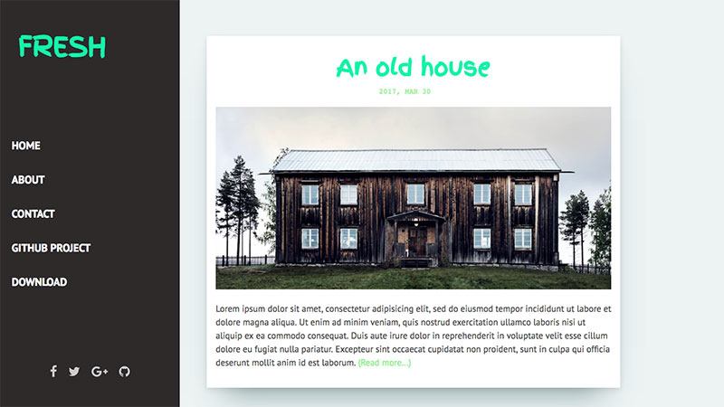

Fresh is a free blog template for Jekyll
=============================

# Demo
Here's a GIF review the Fresh theme.

View this jekyll theme in action [here](http://artemsheludko.pw/fresh/)

Integrations
  - [Google Fonts](https://fonts.google.com/)
  - [Disqus](https://disqus.com/)
  - [Font Awesome](http://fontawesome.io/)
  - Social media links

# How to Use

  For those unfamiliar with how Jekyll works, check out [jekyllrb.com](https://jekyllrb.com/) for all the details,
  or read up on just the basics of [front matter](https://jekyllrb.com/docs/frontmatter/), [writing posts](https://jekyllrb.com/docs/posts/),
  and [creating pages](https://jekyllrb.com/docs/pages/).
